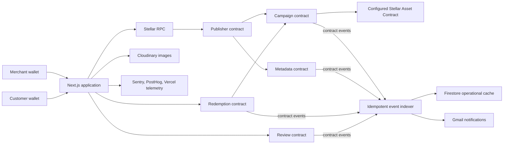

<p align="center">
  
</p>

<h1 align="center">WrenPass</h1>

<p align="center"><strong>Invest in a business you trust. Get more value back.</strong></p>

<p align="center">
  WrenPass helps small businesses unlock working capital by pre-selling limited future-service passes.<br />
  Customers pay with a Stellar asset today and receive more service value later.
</p>

| Name              | Evidence                                                                                       |
| ----------------- | ---------------------------------------------------------------------------------------------- |
| Live product      | [wrenpass.vercel.app](https://wrenpass.vercel.app)                                             |
| Demo video        | [Watch the WrenPass demo](https://x.com/wrenpasscorp/status/2087435276172120326?s=20)          |
| On-chain reviews  | [wrenpass.vercel.app/reviews](https://wrenpass.vercel.app/reviews)                             |
| Testnet contracts | [Deployment manifest](deployments/testnet.json)                                                |
| User-wallet proof | [11-wallet evidence table](#proof-of-10-user-wallets)                                          |
| CI pipeline       | [CI workflow](https://github.com/ianpurif/wrenpass/actions/workflows/ci.yml)                   |
| Delivery pipeline | [Deploy to Vercel workflow](https://github.com/ianpurif/wrenpass/actions/workflows/deploy.yml) |


## Contents

- [Product](#product)
- [How WrenPass works](#how-wrenpass-works)
- [Why Stellar](#why-stellar)
- [Core engineering challenge](#core-engineering-challenge)
- [Implemented product](#implemented-product)
- [Architecture](#architecture)
- [Soroban contracts](#soroban-contracts)
- [Testnet deployment proof](#testnet-deployment-proof)
- [Proof of 10+ user wallets](#proof-of-10-user-wallets)
- [User feedback](#user-feedback)
- [Product and engineering screenshots](#product-and-engineering-screenshots)
- [Run locally](#run-locally)
- [Test and verify](#test-and-verify)
- [CI/CD and production operations](#cicd-and-production-operations)
- [Level 3 evidence](#level-3-evidence)
- [Level 4 evidence](#level-4-evidence)
- [Current limits and roadmap](#current-limits-and-roadmap)

## Product

### Problem

Small businesses often need capital to buy equipment, add capacity, or expand. Bank loans can be expensive or unavailable. Equity funding is usually not practical for a local service business.

### Solution

WrenPass lets a business raise capital directly from customers who already trust it.

For example, a barber can publish this offer:

> Pay 4 USDC today and receive 5 USDC worth of haircuts later.

The business receives working capital now. The customer receives useful bonus value later. The business does not take a loan or give up ownership. The pass is service value, not a speculative token.

### Target users

- Barbers and salons
- Tutors and coaches
- Gyms and fitness instructors
- Repair shops
- Designers, creators, and other service providers
- Customers who want to support a trusted business and receive more value

Customers can use a pass or gift an active pass to another Stellar wallet.

## How WrenPass works

```text
Merchant creates an offer
        ↓
Soroban fixes the campaign terms and maximum pass supply
        ↓
Customer pays with the configured Stellar asset
        ↓
Contract splits merchant funds, protection reserve, and platform fee
        ↓
Customer receives a unique pass record
        ↓
Customer uses or gifts the pass
        ↓
Merchant scans the QR and the current owner approves redemption
        ↓
Soroban marks the pass redeemed and prevents reuse
```

The QR code identifies the pass. It is not a bearer credential. Scanning alone cannot redeem another person's pass.

### Customer flow

1. Open a merchant's shared campaign link.
2. Connect a Freighter wallet on Testnet.
3. Review the price, service value, bonus, expiration, remaining supply, and protected amount.
4. Approve the purchase transaction.
5. View the pass and purchase transaction in the customer workspace.
6. Use the pass, gift it, or show its branded QR code.
7. Approve redemption with the current owner's wallet.
8. Optionally submit an on-chain review. WrenPass sponsors the fee while the wallet still authorizes the review.

### Merchant flow

1. Connect and authenticate a Stellar wallet.
2. Publish the business profile.
3. Create a campaign with fixed financial terms, supply, and expiration.
4. Share the public campaign URL.
5. Track sales, funds, supply, and on-chain activity.
6. Scan a customer's pass QR code.
7. Request owner approval and complete redemption.

## Why Stellar

WrenPass needs payments, programmable rules, wallet authorization, asset access, and public verification in one system. Stellar provides these parts without adding a speculative token.

- **Soroban smart contracts** enforce campaign terms, supply, ownership, payment distribution, and lifecycle transitions.
- **Stellar Asset Contract integration** lets the campaign contract transfer the configured Stellar asset through a standard token interface.
- **Low-cost transactions** fit small service purchases and sponsored actions.
- **Fast finality** supports an in-person purchase and QR redemption flow.
- **Contract events and Stellar RPC** provide an auditable activity stream for the application indexer.
- **Freighter and Stellar Wallets Kit** give users non-custodial transaction approval.
- **Stellar Expert links** let judges and users inspect contracts and transactions independently.

Useful official references: [Soroban overview](https://developers.stellar.org/docs/build/smart-contracts/overview), [Stellar Asset Contract](https://developers.stellar.org/docs/tokens/stellar-asset-contract), [contract events](https://developers.stellar.org/docs/learn/fundamentals/stellar-data-structures/events), [Stellar RPC](https://developers.stellar.org/docs/data/apis/rpc), and [wallet integration](https://developers.stellar.org/docs/tools/developer-tools/wallets).

## Core engineering challenge

The difficult part is connecting an on-chain pass to a real service without turning the QR into a transferable secret or the database into a financial authority.

WrenPass addresses that problem by:

- fixing supply and financial rules in Soroban before customers buy;
- moving the configured Stellar asset inside the contract instead of trusting a web-server payment record;
- assigning each pass to a wallet and checking the current owner on every gift, redemption, and refund;
- requiring both the correct merchant and current owner in the redemption flow;
- keeping the QR limited to pass identity;
- defining deterministic reserve and refund rules instead of adding an unverifiable dispute process;
- treating Firestore as a rebuildable operational index; and
- using idempotent recovery when RPC, indexing, or email delivery is temporarily unavailable.

The current product does not claim to solve merchant KYB or subjective service disputes. Those limits are stated in [Current limits](#current-limits).

## Implemented product

| Area                | Current implementation                                                                                                            |
| ------------------- | --------------------------------------------------------------------------------------------------------------------------------- |
| Wallet              | Freighter through Stellar Wallets Kit, persisted client connection, network checks, balances, and server-verified SEP-53 sessions |
| Merchant profile    | Wallet-authenticated public business metadata stored in the metadata contract; images stored in Cloudinary                        |
| Campaign publishing | Atomic publisher contract calls campaign and metadata contracts before making the campaign public                                 |
| Campaign rules      | Fixed supply, price, service value, expiration, payment split, protection reserve, immutable financial terms after sales start    |
| Purchase            | Customer-authorized Stellar asset transfer, unique pass assignment, payment distribution, event emission, and explorer link       |
| Pass lifecycle      | Active, Redeemed, Expired, and Refunded states; gifting changes ownership without creating another pass                           |
| Redemption          | Branded QR identifies the pass; short-lived sponsored request plus current-owner wallet approval is required                      |
| Refunds             | Deterministic contract-defined eligibility; the UI does not promise a guaranteed full refund                                      |
| Reviews             | Wallet-authorized rating and message stored in the review contract; platform-sponsored fee; public paginated review feed          |
| Activity            | Cursor-based Stellar event ingestion, idempotent indexing, immediate post-transaction reconciliation, and scheduled recovery      |
| Notifications       | Optional Gmail email for purchase, gift, receipt, redemption, expiration, refund, and sold-out events                             |
| Operations          | Sentry, PostHog, Vercel Analytics, Speed Insights, protected cron recovery, and Soroban TTL maintenance                           |

## Architecture



## Project folder structure

The application is organized by responsibility: Next.js presentation and routing live in `src/app` and `src/components`, domain behavior lives in `src/features`, blockchain access is isolated in `src/lib` and `src/server`, and Soroban source remains independently testable under `contracts`.

### Folder purpose guide

| Path | Purpose |
| --- | --- |
| `.github/` | Dependabot configuration, CI quality gates, and protected Vercel deployment automation |
| `contracts/` | Rust/Soroban contract source, tests, workspace configuration, and locked dependencies |
| `deployments/` | Immutable Testnet contract addresses, source commits, WASM hashes, and transaction evidence |
| `docs/` | Deployment, production-release, and operations runbooks |
| `e2e/` | Playwright critical user journeys |
| `patches/` | pnpm dependency patches required for reproducible installation |
| `public/` | App branding, background media, product screenshots, mobile screenshots, and judge evidence |
| `scripts/` | Deployment, migration, audit, smoke-test, reporting, TTL, and scheduled-operations tools |
| `src/app/` | Next.js pages, layouts, global styles, error boundary, and server API route handlers |
| `src/components/` | Reusable product, dashboard, wallet, form, dialog, review, and layout components with tests |
| `src/features/` | Feature DTOs, validation, browser-side APIs, authorization helpers, and workflows with tests |
| `src/generated/` | TypeScript clients and types generated from the five deployed Soroban contracts |
| `src/lib/` | Shared analytics, styling, Stellar configuration, wallet adapters, and contract clients |
| `src/server/` | Server-only Stellar, Firestore, Cloudinary, email, event, wallet-auth, review, and operations logic |
| `src/test/` | Shared Vitest setup, server-only shim, and test fixtures |
| Root configuration | Environment template, package manifests, tool configuration, security policy, and project documentation |

### Complete file inventory

This inventory contains all **313 project files currently present and not ignored**. Local secrets and generated runtime/build directories such as `.env.local`, `.git/`, `node_modules/`, `.next/`, `contracts/target/`, `playwright-report/`, and `test-results/` are intentionally excluded.

```text
wrenpass/
├── .env.example
├── .github/
│   ├── dependabot.yml
│   └── workflows/
│       ├── ci.yml
│       └── deploy.yml
├── .gitignore
├── .vercelignore
├── AGENTS.md
├── contracts/
│   ├── Cargo.lock
│   ├── Cargo.toml
│   ├── wrenpass-campaign/
│   │   ├── Cargo.toml
│   │   └── src/
│   │       ├── lib.rs
│   │       └── test.rs
│   ├── wrenpass-metadata/
│   │   ├── Cargo.toml
│   │   └── src/
│   │       ├── lib.rs
│   │       └── test.rs
│   ├── wrenpass-publisher/
│   │   ├── Cargo.toml
│   │   └── src/
│   │       ├── lib.rs
│   │       └── test.rs
│   ├── wrenpass-redemptions/
│   │   ├── Cargo.toml
│   │   └── src/
│   │       ├── lib.rs
│   │       └── test.rs
│   └── wrenpass-reviews/
│       ├── Cargo.toml
│       └── src/
│           ├── lib.rs
│           └── test.rs
├── deployments/
│   └── testnet.json
├── docs/
│   ├── DEPLOYMENT.md
│   ├── OPERATIONS.md
│   └── PRODUCTION.md
├── e2e/
│   └── critical-journeys.spec.ts
├── eslint.config.mjs
├── next.config.ts
├── package.json
├── patches/
│   └── base32.js@0.1.0.patch
├── playwright.config.ts
├── pnpm-lock.yaml
├── pnpm-workspace.yaml
├── postcss.config.mjs
├── public/
│   ├── bg.mp4
│   ├── ci-cd1.png
│   ├── ci-cd2.png
│   ├── ci-cd3.png
│   ├── ci-cd-code.png
│   ├── logo.png
│   ├── logo-qr.png
│   ├── mobile-view1.png
│   ├── mobile-view2.png
│   ├── mobile-view3.png
│   ├── mobile-view4.png
│   ├── posthog1.png
│   ├── posthog2.png
│   ├── productui1.png
│   ├── productui2.png
│   ├── productui3.png
│   ├── productui4.png
│   ├── sentry1.png
│   ├── sentry2.png
│   ├── sentry3.png
│   ├── Test-output.png
│   └── usersreview.png
├── README.md
├── scripts/
│   ├── audit-offchain-boundary.ts
│   ├── cleanup-expired-wallet-auth.ts
│   ├── deploy-campaign-publisher.ts
│   ├── deploy-contract-suite.ts
│   ├── export-user-wallet-interactions.ts
│   ├── maintain-stellar-ttl.ts
│   ├── migrate-campaign-transaction-index.ts
│   ├── migrate-metadata-profile-index.ts
│   ├── migrate-review-event-index.ts
│   ├── minimize-offchain-pii.ts
│   ├── plan-stellar-ttl.ts
│   ├── run-scheduled-operations.ts
│   ├── smoke-services.ts
│   ├── smoke-stellar.ts
│   └── verify-contract-deployments.ts
├── SECURITY.md
├── src/
│   ├── app/
│   │   ├── api/
│   │   │   ├── campaigns/
│   │   │   │   └── [campaignId]/
│   │   │   │       └── transactions/
│   │   │   │           └── route.ts
│   │   │   ├── cron/
│   │   │   │   └── operations/
│   │   │   │       └── route.ts
│   │   │   ├── customer/
│   │   │   │   ├── activity/
│   │   │   │   │   └── route.ts
│   │   │   │   └── passes/
│   │   │   │       └── route.ts
│   │   │   ├── events/
│   │   │   │   └── sync/
│   │   │   │       └── route.ts
│   │   │   ├── merchant/
│   │   │   │   ├── campaigns/
│   │   │   │   │   └── route.ts
│   │   │   │   ├── images/
│   │   │   │   │   └── route.ts
│   │   │   │   └── profile/
│   │   │   │       └── route.ts
│   │   │   ├── notifications/
│   │   │   │   └── profile/
│   │   │   │       └── route.ts
│   │   │   ├── redemptions/
│   │   │   │   ├── route.ts
│   │   │   │   └── validate/
│   │   │   │       └── route.ts
│   │   │   ├── reviews/
│   │   │   │   ├── route.ts
│   │   │   │   └── sponsor/
│   │   │   │       └── route.ts
│   │   │   ├── stellar/
│   │   │   │   └── balances/
│   │   │   │       └── route.ts
│   │   │   └── wallet/
│   │   │       ├── challenge/
│   │   │       │   └── route.ts
│   │   │       └── session/
│   │   │           └── route.ts
│   │   ├── campaigns/
│   │   │   └── [campaignId]/
│   │   │       ├── loading.test.tsx
│   │   │       ├── loading.tsx
│   │   │       └── page.tsx
│   │   ├── global-error.tsx
│   │   ├── globals.css
│   │   ├── layout.tsx
│   │   ├── merchant/
│   │   │   ├── business-identity/
│   │   │   │   └── page.tsx
│   │   │   ├── create-campaign/
│   │   │   │   └── page.tsx
│   │   │   ├── page.tsx
│   │   │   └── redeem-pass/
│   │   │       └── page.tsx
│   │   ├── page.tsx
│   │   ├── passes/
│   │   │   └── page.tsx
│   │   └── reviews/
│   │       └── page.tsx
│   ├── components/
│   │   ├── campaigns/
│   │   │   ├── campaign-offer.test.tsx
│   │   │   ├── campaign-offer.tsx
│   │   │   ├── campaign-transactions.test.tsx
│   │   │   └── campaign-transactions.tsx
│   │   ├── customer/
│   │   │   ├── customer-pass-card.tsx
│   │   │   ├── customer-workspace.test.tsx
│   │   │   ├── customer-workspace.tsx
│   │   │   ├── gift-pass-dialog.test.tsx
│   │   │   ├── gift-pass-dialog.tsx
│   │   │   ├── pass-qr-dialog.test.tsx
│   │   │   ├── pass-qr-dialog.tsx
│   │   │   ├── purchase-panel.test.tsx
│   │   │   ├── purchase-panel.tsx
│   │   │   ├── redemption-requests.test.tsx
│   │   │   └── redemption-requests.tsx
│   │   ├── home/
│   │   │   ├── cinematic-landing.test.tsx
│   │   │   ├── cinematic-landing.tsx
│   │   │   └── pass-preview.tsx
│   │   ├── layout/
│   │   │   ├── footer.tsx
│   │   │   ├── logo.test.tsx
│   │   │   ├── logo.tsx
│   │   │   ├── navigation.test.tsx
│   │   │   └── navigation.tsx
│   │   ├── merchant/
│   │   │   ├── campaign-card.tsx
│   │   │   ├── campaign-form.test.tsx
│   │   │   ├── campaign-form.tsx
│   │   │   ├── campaign-table-layout.ts
│   │   │   ├── merchant-page-shell.tsx
│   │   │   ├── merchant-workspace.test.tsx
│   │   │   ├── merchant-workspace.tsx
│   │   │   ├── profile-form.test.tsx
│   │   │   ├── profile-form.tsx
│   │   │   ├── redemption-scanner.test.tsx
│   │   │   └── redemption-scanner.tsx
│   │   ├── notifications/
│   │   │   └── notification-email-form.tsx
│   │   ├── reviews/
│   │   │   ├── recent-reviews.test.tsx
│   │   │   ├── recent-reviews.tsx
│   │   │   ├── review-card.tsx
│   │   │   ├── review-prompt-provider.test.tsx
│   │   │   ├── review-prompt-provider.tsx
│   │   │   ├── reviews-feed.test.tsx
│   │   │   └── reviews-feed.tsx
│   │   ├── ui/
│   │   │   ├── button.test.tsx
│   │   │   ├── button.tsx
│   │   │   ├── card.tsx
│   │   │   ├── container.tsx
│   │   │   ├── dialog.test.tsx
│   │   │   ├── dialog.tsx
│   │   │   ├── feedback-state.tsx
│   │   │   ├── image-upload-field.test.tsx
│   │   │   ├── image-upload-field.tsx
│   │   │   ├── input.test.tsx
│   │   │   ├── input.tsx
│   │   │   └── motion-reveal.tsx
│   │   └── wallet/
│   │       ├── connected-wallet-link.tsx
│   │       ├── wallet-button.tsx
│   │       ├── wallet-provider.test.tsx
│   │       ├── wallet-provider.tsx
│   │       ├── wallet-route-guard.test.tsx
│   │       └── wallet-route-guard.tsx
│   ├── features/
│   │   ├── campaign-transactions/
│   │   │   ├── api.ts
│   │   │   ├── dto.ts
│   │   │   └── updates.ts
│   │   ├── customer/
│   │   │   ├── api.test.ts
│   │   │   ├── api.ts
│   │   │   ├── dto.ts
│   │   │   └── validation.ts
│   │   ├── merchant/
│   │   │   ├── api.test.ts
│   │   │   ├── api.ts
│   │   │   ├── campaign-terms.test.ts
│   │   │   ├── campaign-terms.ts
│   │   │   ├── campaign-workflow.test.ts
│   │   │   ├── campaign-workflow.ts
│   │   │   ├── display.ts
│   │   │   └── dto.ts
│   │   ├── notifications/
│   │   │   ├── api.test.ts
│   │   │   └── api.ts
│   │   ├── redemption/
│   │   │   ├── api.ts
│   │   │   ├── dto.ts
│   │   │   ├── qr.test.ts
│   │   │   ├── qr.ts
│   │   │   └── request-authorization.ts
│   │   └── reviews/
│   │       ├── api.ts
│   │       ├── authorization.ts
│   │       ├── dto.ts
│   │       ├── validation.test.ts
│   │       └── validation.ts
│   ├── generated/
│   │   ├── metadata-contract/
│   │   │   ├── .gitignore
│   │   │   ├── package.json
│   │   │   ├── README.md
│   │   │   ├── src/
│   │   │   │   └── index.ts
│   │   │   └── tsconfig.json
│   │   ├── publisher-contract/
│   │   │   ├── .gitignore
│   │   │   ├── package.json
│   │   │   ├── README.md
│   │   │   ├── src/
│   │   │   │   └── index.ts
│   │   │   └── tsconfig.json
│   │   ├── redemptions-contract/
│   │   │   ├── .gitignore
│   │   │   ├── package.json
│   │   │   ├── README.md
│   │   │   ├── src/
│   │   │   │   └── index.ts
│   │   │   └── tsconfig.json
│   │   ├── reviews-contract/
│   │   │   ├── .gitignore
│   │   │   ├── package.json
│   │   │   ├── README.md
│   │   │   ├── src/
│   │   │   │   └── index.ts
│   │   │   └── tsconfig.json
│   │   └── wrenpass-contract/
│   │       ├── .gitignore
│   │       ├── package.json
│   │       ├── README.md
│   │       ├── src/
│   │       │   └── index.ts
│   │       └── tsconfig.json
│   ├── instrumentation.ts
│   ├── instrumentation-client.ts
│   ├── lib/
│   │   ├── analytics.test.ts
│   │   ├── analytics.ts
│   │   ├── cn.ts
│   │   └── stellar/
│   │       ├── config.test.ts
│   │       ├── config.ts
│   │       ├── explorer.ts
│   │       ├── freighter-adapter.ts
│   │       ├── metadata-client.test.ts
│   │       ├── metadata-client.ts
│   │       ├── publisher-client.ts
│   │       ├── redemption-request-client.test.ts
│   │       ├── redemption-request-client.ts
│   │       ├── reviews-client.test.ts
│   │       ├── reviews-client.ts
│   │       ├── transaction-submission.test.ts
│   │       ├── transaction-submission.ts
│   │       └── wrenpass-client.ts
│   ├── sentry.edge.config.ts
│   ├── sentry.server.config.ts
│   ├── server/
│   │   ├── campaign-transactions/
│   │   │   ├── campaign-event-key.ts
│   │   │   ├── campaign-transaction-index.test.ts
│   │   │   ├── campaign-transaction-index.ts
│   │   │   └── service.ts
│   │   ├── cloudinary/
│   │   │   ├── image-service.test.ts
│   │   │   └── image-service.ts
│   │   ├── customer/
│   │   │   ├── customer-service.test.ts
│   │   │   ├── customer-service.ts
│   │   │   └── service.ts
│   │   ├── email/
│   │   │   ├── email-service.test.ts
│   │   │   └── email-service.ts
│   │   ├── env.test.ts
│   │   ├── env.ts
│   │   ├── events/
│   │   │   ├── event-source.ts
│   │   │   ├── event-sync-service.test.ts
│   │   │   ├── event-sync-service.ts
│   │   │   ├── firestore-notification-claim-store.ts
│   │   │   └── service.ts
│   │   ├── firestore/
│   │   │   ├── document-store.ts
│   │   │   ├── firebase-admin.ts
│   │   │   ├── repositories.test.ts
│   │   │   └── repositories.ts
│   │   ├── merchant/
│   │   │   ├── merchant-service.test.ts
│   │   │   ├── merchant-service.ts
│   │   │   ├── metadata-registry-reader.ts
│   │   │   ├── profile-event-index.test.ts
│   │   │   ├── profile-event-index.ts
│   │   │   ├── profile-event-source.ts
│   │   │   └── service.ts
│   │   ├── models.ts
│   │   ├── operations/
│   │   │   ├── cron-auth.test.ts
│   │   │   ├── cron-auth.ts
│   │   │   ├── operational-state-store.test.ts
│   │   │   ├── operational-state-store.ts
│   │   │   ├── operations-service.test.ts
│   │   │   ├── operations-service.ts
│   │   │   ├── ttl-maintenance-service.test.ts
│   │   │   └── ttl-maintenance-service.ts
│   │   ├── redemption/
│   │   │   ├── redemption-registry.test.ts
│   │   │   ├── redemption-registry.ts
│   │   │   ├── redemption-service.test.ts
│   │   │   ├── redemption-service.ts
│   │   │   └── service.ts
│   │   ├── reviews/
│   │   │   ├── reader-service.ts
│   │   │   ├── review-event-index.test.ts
│   │   │   ├── review-event-index.ts
│   │   │   ├── review-event-source.ts
│   │   │   ├── review-reader.test.ts
│   │   │   ├── review-reader.ts
│   │   │   ├── review-sponsor-guard.test.ts
│   │   │   ├── review-sponsor-guard.ts
│   │   │   ├── review-sponsorship-service.test.ts
│   │   │   ├── review-sponsorship-service.ts
│   │   │   └── service.ts
│   │   ├── stellar/
│   │   │   ├── balance-service.test.ts
│   │   │   ├── balance-service.ts
│   │   │   ├── campaign-reader.ts
│   │   │   ├── customer-chain-reader.test.ts
│   │   │   ├── customer-chain-reader.ts
│   │   │   ├── event-retention.test.ts
│   │   │   ├── event-retention.ts
│   │   │   ├── purchase-readiness.test.ts
│   │   │   ├── purchase-readiness.ts
│   │   │   ├── rpc-gateway.ts
│   │   │   ├── services.ts
│   │   │   ├── ttl-service.test.ts
│   │   │   └── ttl-service.ts
│   │   └── wallet-auth/
│   │       ├── auth-service.test.ts
│   │       ├── auth-service.ts
│   │       ├── firestore-auth-store.test.ts
│   │       ├── firestore-auth-store.ts
│   │       ├── request-session.ts
│   │       └── service.ts
│   └── test/
│       ├── fixtures/
│       │   └── customer.ts
│       ├── server-only.ts
│       └── setup.ts
├── tsconfig.json
├── vercel.json
└── vitest.config.ts
```

### Source of truth

| On-chain and authoritative                        | Off-chain and operational                        |
| ------------------------------------------------- | ------------------------------------------------ |
| Campaign financial configuration and status       | Opaque wallet challenges and sessions            |
| Fixed supply, sold count, and redeemed count      | Idempotent event index and recovery cursor       |
| Pass IDs, owners, and lifecycle states            | Notification delivery records                    |
| Stellar asset settlement and protection reserve   | Optional notification email setting              |
| Public merchant profile and campaign descriptions | Cloudinary provider-management references        |
| Pending owner-approved redemption requests        | Leases, rate limits, and operational checkpoints |
| Review wallet, rating, and message                | Monitoring and privacy-safe analytics            |

Firestore is never treated as the authority for balances, payments, pass ownership, supply, or redemption. If indexing or email delivery is unavailable, the on-chain state remains valid.

### Security boundaries

- Server actions use a signed SEP-53 challenge and an opaque HTTP session. A client-provided wallet address is never enough.
- Merchant, customer, pass-owner, and reviewer actions require the correct wallet authorization in the contracts.
- The campaign contract reads its own integer-safe financial configuration. It does not trust client-calculated payment values.
- Basis points and integer asset units avoid JavaScript floating-point financial calculations.
- The QR contains pass identity only. The current owner must authorize redemption.
- Sponsored review and redemption transactions still require the user's contract authorization.
- Firebase Admin, Cloudinary secrets, Gmail credentials, sponsor keys, and monitoring tokens stay on the server.
- PostHog uses an event allowlist and excludes wallet addresses, emails, transaction hashes, review text, and financial values.
- Sentry removes request bodies, headers, cookies, query strings, and default personal information.

See [SECURITY.md](SECURITY.md) for the complete trust model.

## Soroban contracts

The repository contains five focused Rust contracts in the [contracts](contracts) workspace.

| Contract                                                      | Responsibility                                                                                                                                           | Inter-contract work                                                                   |
| ------------------------------------------------------------- | -------------------------------------------------------------------------------------------------------------------------------------------------------- | ------------------------------------------------------------------------------------- |
| [Campaign](contracts/wrenpass-campaign/src/lib.rs)            | Campaign configuration, fixed supply, Stellar asset payment split, pass ownership, gift, redeem, refund, cancellation, storage TTL, and lifecycle events | Uses the configured Stellar Asset Contract token client                               |
| [Metadata](contracts/wrenpass-metadata/src/lib.rs)            | Authoritative merchant profile and campaign text metadata                                                                                                | Calls `get_campaign` to verify the campaign and merchant before metadata registration |
| [Campaign publisher](contracts/wrenpass-publisher/src/lib.rs) | One merchant-authorized transaction creates the campaign, registers metadata, and publishes it                                                           | Calls campaign and metadata contracts atomically                                      |
| [Redemptions](contracts/wrenpass-redemptions/src/lib.rs)      | Short-lived, platform-sponsored redemption request and owner approval state                                                                              | Calls the campaign contract to validate pass and campaign data                        |
| [Reviews](contracts/wrenpass-reviews/src/lib.rs)              | Stores reviewer wallet, 1-5 rating, message, timestamp, and events                                                                                       | Accepts reviewer authorization while the platform sponsors the transaction fee        |

The campaign contract emits meaningful events for campaign creation and status, purchase, gift, redemption, refund, and cancellation. Other contracts emit profile, metadata, redemption-request, and review events. The indexer derives sold-out notifications from the authoritative campaign state after a purchase.

## Testnet deployment proof

Network: **Stellar Testnet**<br />
RPC: `https://soroban-testnet.stellar.org`<br />
Deployment manifest: [deployments/testnet.json](deployments/testnet.json)

Configured Testnet payment asset:

| Code                   | Issuer                                                                                                                                                                 | Stellar Asset Contract                                                                                                                                                  |
| ---------------------- | ---------------------------------------------------------------------------------------------------------------------------------------------------------------------- | ----------------------------------------------------------------------------------------------------------------------------------------------------------------------- |
| `USDC` (Testnet label) | [`GBBD47IF6LWK7P7MDEVSCWR7DPUWV3NY3DTQEVFL4NAT4AQH3ZLLFLA5`](https://stellar.expert/explorer/testnet/account/GBBD47IF6LWK7P7MDEVSCWR7DPUWV3NY3DTQEVFL4NAT4AQH3ZLLFLA5) | [`CBIELTK6YBZJU5UP2WWQEUCYKLPU6AUNZ2BQ4WWFEIE3USCIHMXQDAMA`](https://stellar.expert/explorer/testnet/contract/CBIELTK6YBZJU5UP2WWQEUCYKLPU6AUNZ2BQ4WWFEIE3USCIHMXQDAMA) |

This is a configured Testnet asset, not Circle mainnet USDC.

| Contract           | Testnet address                                                                                                                                                         | Deployed WASM SHA-256                                              | Deployment transaction                                                                                                                                                            |
| ------------------ | ----------------------------------------------------------------------------------------------------------------------------------------------------------------------- | ------------------------------------------------------------------ | --------------------------------------------------------------------------------------------------------------------------------------------------------------------------------- |
| Campaign           | [`CAFVI2IDYFQKBWVQ7V6JIEUSH63HWVPS2YAVGASW6QUKB24AA6N76V5D`](https://stellar.expert/explorer/testnet/contract/CAFVI2IDYFQKBWVQ7V6JIEUSH63HWVPS2YAVGASW6QUKB24AA6N76V5D) | `aeec070bd69017b5201f25317908e3bdd9349971a7c8cf39ff9d1f1095c1ff33` | Historical hash not retained; WASM verified                                                                                                                                       |
| Metadata           | [`CCPREVJISOBTO25UJSS53YIA7UMRXCYLUTJBA5K4CSGLTRI4P4IOVFDR`](https://stellar.expert/explorer/testnet/contract/CCPREVJISOBTO25UJSS53YIA7UMRXCYLUTJBA5K4CSGLTRI4P4IOVFDR) | `56ff566c2f2732deb02d690ec5e68316cc12b73f8a4a2fafc53840685c976e97` | Historical hash not retained; WASM verified                                                                                                                                       |
| Campaign publisher | [`CALEYUTH2ZJOU3DXREQG5IGGZ3JWIRUS6P6OT6F25ER5IGTXVSAL5JXS`](https://stellar.expert/explorer/testnet/contract/CALEYUTH2ZJOU3DXREQG5IGGZ3JWIRUS6P6OT6F25ER5IGTXVSAL5JXS) | `4a1183fecc93e185b5a917e6ddf675715765e7311951cdbb48259597cc290342` | [`86d607741f55f09204e5ac0b5c0306886c5c1c927909cf0ba5faf92c006d3db9`](https://stellar.expert/explorer/testnet/tx/86d607741f55f09204e5ac0b5c0306886c5c1c927909cf0ba5faf92c006d3db9) |
| Redemptions        | [`CB6HZLQJGSZBN6NCII2KGOHIQUSG33YQCM7XWGTUK6JTJ4HLSKY65QHN`](https://stellar.expert/explorer/testnet/contract/CB6HZLQJGSZBN6NCII2KGOHIQUSG33YQCM7XWGTUK6JTJ4HLSKY65QHN) | `3e7e47cc108d6376079b0453e1499248a84f7f09fde3e769df32a8e9f2c36c40` | Historical hash not retained; WASM verified                                                                                                                                       |
| Reviews            | [`CCZ7KC6SGTFJKOPVUFD6WYNBSYGOCHBUNV5HNR2AVGFP23KBOOMF6WY3`](https://stellar.expert/explorer/testnet/contract/CCZ7KC6SGTFJKOPVUFD6WYNBSYGOCHBUNV5HNR2AVGFP23KBOOMF6WY3) | `b0605d6e1da7fcb1229aa18a25ddd22ded196058945bc26577a145ab2fcb427c` | Historical hash not retained; WASM verified                                                                                                                                       |

Four early deployment transaction hashes were not retained. This limitation is recorded in the manifest instead of being hidden. Each contract entry pins its exact historical source commit, toolchain, contract address, and WASM hash. The CI provenance job rebuilds the historical source and checks the installed Testnet WASM:

```bash
pnpm contract:verify:testnet
```

### Successful contract interactions

| Interaction                     | Transaction hash                                                                                                                                                                  |       Ledger | Indexed at (UTC)        |
| ------------------------------- | --------------------------------------------------------------------------------------------------------------------------------------------------------------------------------- | -----------: | ----------------------- |
| Atomic publisher initialization | [`d081ae9dd92d628be48d90b9e743c8871560be4c9fde7d78533c5e0114fa3455`](https://stellar.expert/explorer/testnet/tx/d081ae9dd92d628be48d90b9e743c8871560be4c9fde7d78533c5e0114fa3455) | See explorer | See explorer            |
| Pass purchase                   | [`ec8da8a6aceeb6e9ae62fb0a7499f510831cbe0577a17d49bbff8a14a09ca6ec`](https://stellar.expert/explorer/testnet/tx/ec8da8a6aceeb6e9ae62fb0a7499f510831cbe0577a17d49bbff8a14a09ca6ec) |    4,069,759 | 2026-08-10 13:52:42.611 |
| Pass gift                       | [`98e3e38c78899a3f03b3c6e7472cae1d030247e07d88071927695ec0a1d45adf`](https://stellar.expert/explorer/testnet/tx/98e3e38c78899a3f03b3c6e7472cae1d030247e07d88071927695ec0a1d45adf) |    4,098,213 | 2026-08-12 05:23:26.982 |
| Pass redemption                 | [`44991dba47a8d7d3de9a77af506eef3987967dec584a3a630258af65a136603e`](https://stellar.expert/explorer/testnet/tx/44991dba47a8d7d3de9a77af506eef3987967dec584a3a630258af65a136603e) |    4,069,805 | 2026-08-10 14:02:14.763 |
| Review submission               | [`faa00e0de414f3f50dffb3ed4013c711c5bf00bb538d777337e1e178869db044`](https://stellar.expert/explorer/testnet/tx/faa00e0de414f3f50dffb3ed4013c711c5bf00bb538d777337e1e178869db044) |    4,097,490 | 2026-08-12 04:23:03.633 |

`indexedAt` is the application's cache time. The ledger number and Stellar transaction are the authoritative order and proof.

## Proof of 10+ user wallets

The local root export `wallet-report.json` was generated from real retained application data on **2026-08-12 at 07:37:48.284 UTC**. The public proof below includes only wallet and blockchain fields. The raw export also contains private operational data and must not be committed or shared without redaction.

### Snapshot totals

| Metric                                           | Result |
| ------------------------------------------------ | -----: |
| Distinct Stellar wallet addresses                | **11** |
| Unique on-chain event IDs                        | **40** |
| Unique Stellar transaction hashes                | **40** |
| Wallet-attributed blockchain records             | **45** |
| Verified wallet sessions retained at export time |      2 |
| Notification records                             |      6 |
| Managed Cloudinary asset references              |      8 |

The 45 count is an attribution count. A two-party gift or redemption is attached to both participant wallets. After deduplication, the report contains 40 unique event IDs and 40 unique transaction hashes. Wallet addresses prove distinct accounts; they should not be interpreted as proof of 11 unique human identities.

### Event distribution

| Event type             | Unique on-chain events | Wallet attributions |
| ---------------------- | ---------------------: | ------------------: |
| `campaign_created`     |                      8 |                   8 |
| `merchant_profile_set` |                      3 |                   3 |
| `pass_purchased`       |                     13 |                  13 |
| `pass_gifted`          |                      2 |                   4 |
| `pass_redeemed`        |                      3 |                   6 |
| `review_submitted`     |                     11 |                  11 |
| **Total**              |                 **40** |              **45** |

### Wallet-level proof

| ID  | Wallet address                                             | Interactions | Event types                                          | Roles                                          |        Ledger range |
| --- | ---------------------------------------------------------- | -----------: | ---------------------------------------------------- | ---------------------------------------------- | ------------------: |
| W1  | `GA27SB63Y3TKTUOW3GBE7BF6ZU6NOCPX6PSO3TCNBVOCDUYQQ7O2GD2H` |            3 | Gift, purchase, review                               | Customer, previous owner, reviewer             | 4,097,486-4,098,213 |
| W2  | `GA2LG25AK4TPIZH7S2LVVIOYRTNTQRLOXEDZEKPWBRL66NQESSPZQVRZ` |            2 | Gift, purchase                                       | Customer, previous owner                       | 4,048,437-4,048,485 |
| W3  | `GA5GX6HXCZVXWJ6W5ZEQSLH5FCLGDBYOGJMYO5B3SMJBF5YXDD3MYL3W` |            2 | Gift, redemption                                     | Owner, recipient                               | 4,098,213-4,098,289 |
| W4  | `GA5P65P3SDKNH7OV6WBRGL2EOM7MABZC6VDS6BQRPNH4K6HBGVCKCD2O` |            3 | Merchant profile, purchase, review                   | Customer, merchant, reviewer                   | 4,066,506-4,069,034 |
| W5  | `GADRDDWDRMVMA3UBOSZAA5NYPO6RPH6NRYMA5SCGDE33E7NC46P7KGDO` |           11 | Campaign, merchant profile, redemption, review       | Merchant, reviewer                             | 4,047,981-4,096,849 |
| W6  | `GAV5YXNQ5LD3SRTCHMXVYWS7BVHE5ZTZODZF2DOQA7F2J2IARWB5BL6D` |            3 | Purchase                                             | Customer                                       | 4,099,799-4,099,810 |
| W7  | `GBLYXTXRCTOA5C2FN4GDHGUPEBFFAHZVA46HB6NYJMHCL3GWMPKBPL3D` |            3 | Campaign, redemption, review                         | Merchant, reviewer                             | 4,097,458-4,098,289 |
| W8  | `GC4LXTPHSIV2UQWTQACO7ZHJRQA4KJLIPOJ2NJTNYRMKIILZV3RYNQJH` |           10 | Merchant profile, gift, purchase, redemption, review | Customer, merchant, owner, recipient, reviewer | 4,048,485-4,069,805 |
| W9  | `GCR4JB3TV7FZCXD4GKLYOWUYMHJL4KQIUUN23UGNKQRRP2L33NE6L4LM` |            2 | Purchase, review                                     | Customer, reviewer                             | 4,081,469-4,081,475 |
| W10 | `GDJ44GXZZDDCXVQPGPFWQ6J37CLV46MHQRJUHWHO6YQLKIMYWRXVYPNK` |            4 | Purchase, review                                     | Customer, reviewer                             | 4,096,585-4,096,609 |
| W11 | `GDMQTZTIFMIJ2B6S26XADEOGXWGEU25EOMAUPWTG7FCC3HGG7ZYFU4NM` |            2 | Purchase, review                                     | Customer, reviewer                             | 4,088,539-4,088,545 |

### Latest retained transaction for each wallet

| Wallet | Event                  | Transaction hash                                                                                                                                                                  |    Ledger | Indexed at (UTC)        |
| ------ | ---------------------- | --------------------------------------------------------------------------------------------------------------------------------------------------------------------------------- | --------: | ----------------------- |
| W1     | `pass_gifted`          | [`98e3e38c78899a3f03b3c6e7472cae1d030247e07d88071927695ec0a1d45adf`](https://stellar.expert/explorer/testnet/tx/98e3e38c78899a3f03b3c6e7472cae1d030247e07d88071927695ec0a1d45adf) | 4,098,213 | 2026-08-12 05:23:26.982 |
| W2     | `pass_gifted`          | [`33aff12d6f8155ded2723b927b4d8b1256b7d5ed5ffff9844f471c844f22c040`](https://stellar.expert/explorer/testnet/tx/33aff12d6f8155ded2723b927b4d8b1256b7d5ed5ffff9844f471c844f22c040) | 4,048,485 | 2026-08-09 10:38:53.301 |
| W3     | `pass_redeemed`        | [`0ec788cf7928f7a2b16386a668290f46ba64833d9deab473c28b72ba2d6bb39c`](https://stellar.expert/explorer/testnet/tx/0ec788cf7928f7a2b16386a668290f46ba64833d9deab473c28b72ba2d6bb39c) | 4,098,289 | 2026-08-12 05:29:48.331 |
| W4     | `merchant_profile_set` | [`ae1cfc7f2fd0b3c96aa14e7aedc8224d352cd63a64a3ced9f2d756765d730d9a`](https://stellar.expert/explorer/testnet/tx/ae1cfc7f2fd0b3c96aa14e7aedc8224d352cd63a64a3ced9f2d756765d730d9a) | 4,069,034 | 2026-08-10 12:48:05.000 |
| W5     | `campaign_created`     | [`9553c88314dbbd9b8f037a8b5c9c910fc2dedf0f793597d919cc105c8bf6f987`](https://stellar.expert/explorer/testnet/tx/9553c88314dbbd9b8f037a8b5c9c910fc2dedf0f793597d919cc105c8bf6f987) | 4,096,849 | 2026-08-12 04:20:27.051 |
| W6     | `pass_purchased`       | [`fcbe6b15a812c5ce56a4ba4f4a6cd7640f575df31fdf03bc14c2708430908f88`](https://stellar.expert/explorer/testnet/tx/fcbe6b15a812c5ce56a4ba4f4a6cd7640f575df31fdf03bc14c2708430908f88) | 4,099,810 | 2026-08-12 07:36:42.991 |
| W7     | `pass_redeemed`        | [`0ec788cf7928f7a2b16386a668290f46ba64833d9deab473c28b72ba2d6bb39c`](https://stellar.expert/explorer/testnet/tx/0ec788cf7928f7a2b16386a668290f46ba64833d9deab473c28b72ba2d6bb39c) | 4,098,289 | 2026-08-12 05:29:48.331 |
| W8     | `pass_redeemed`        | [`44991dba47a8d7d3de9a77af506eef3987967dec584a3a630258af65a136603e`](https://stellar.expert/explorer/testnet/tx/44991dba47a8d7d3de9a77af506eef3987967dec584a3a630258af65a136603e) | 4,069,805 | 2026-08-10 14:02:14.763 |
| W9     | `review_submitted`     | [`3d464a520615491ff78cacb06aacd6e6258c544182fdda317f967f5cda97214a`](https://stellar.expert/explorer/testnet/tx/3d464a520615491ff78cacb06aacd6e6258c544182fdda317f967f5cda97214a) | 4,081,475 | 2026-08-11 06:06:27.875 |
| W10    | `review_submitted`     | [`0d350bf63c73ee7782d53d0ff6259db732833ec62e4d864e24c29a18f7a4d130`](https://stellar.expert/explorer/testnet/tx/0d350bf63c73ee7782d53d0ff6259db732833ec62e4d864e24c29a18f7a4d130) | 4,096,609 | 2026-08-12 03:09:32.377 |
| W11    | `review_submitted`     | [`6d2f60dbdec212657d4d87b12a640f8c50ea764e365d53494a38a7878c6c2d8c`](https://stellar.expert/explorer/testnet/tx/6d2f60dbdec212657d4d87b12a640f8c50ea764e365d53494a38a7878c6c2d8c) | 4,088,545 | 2026-08-11 15:56:29.650 |

### Reproduce the report

With valid local Firebase and Stellar configuration:

```bash
pnpm users:wallet-report --output ./wallet-report.json --force
```

This is a private administrative export. Review and redact optional emails, notifications, and provider-management records before sharing it. The exporter paginates the retained collections, validates every record, enriches indexed events with still-retained Stellar RPC actor topics, excludes session tokens and challenges, and sorts blockchain activity by ledger and event index. See [scripts/export-user-wallet-interactions.ts](scripts/export-user-wallet-interactions.ts).

## User feedback

The live review contract contained **11 reviews with an average rating of 4.64/5** in the 2026-08-12 snapshot. Review text and ratings are read from Soroban; Firestore is not a review source of truth.

Common positive themes:

- Fast purchase flow: “very fast to buy”
- Simple merchant flow: “easy to create campaign”
- Clear customer value: “i get more value”
- Smooth experience: “it's so seamless experience”

One 3-star response mentioned slow internet. The full unedited set remains visible on the [on-chain reviews page](https://wrenpass.vercel.app/reviews) and through each linked transaction.


## Product and engineering screenshots

### Product UI


### Mobile responsive UI

<table>
  <tr>
    <td align="center"></td>
    <td align="center"></td>
    <td align="center"></td>
    <td align="center"></td>
  </tr>
  <tr>
    <td align="center">Landing</td>
    <td align="center">Create campaign</td>
    <td align="center">Redeem pass</td>
    <td align="center">Buy pass</td>
  </tr>
</table>

### CI/CD and test output

The captured CI run shows all application, contract/provenance, and critical browser jobs passing.


The protected delivery workflow completed a Vercel deployment.


The captured local test run shows **59 passing test files and 165 passing tests**, which is above the required three-test screenshot threshold.


### Monitoring and analytics

Sentry captures production errors, transactions, releases, and health signals.


PostHog receives privacy-safe product and web analytics.


## Run locally

### Requirements

| Tool        | Pinned version  |
| ----------- | --------------- |
| Node.js     | `22.20.0`       |
| pnpm        | `11.16.0`       |
| Rust        | `1.96.1`        |
| Rust target | `wasm32v1-none` |
| Stellar CLI | `27.0.0`        |
| Soroban SDK | `27.0.5`        |

Freighter must be installed and set to Testnet for real wallet flows. Never share a secret seed or recovery phrase.

### Install and start

```bash
git clone https://github.com/ianpurif/wrenpass.git
cd wrenpass
pnpm install --frozen-lockfile
cp .env.example .env.local
pnpm dev
```

Open [http://localhost:3000](http://localhost:3000).

On Windows PowerShell, replace the copy command with:

```powershell
Copy-Item .env.example .env.local
```

### Environment variables

Use [.env.example](.env.example) as the only template. Replace its placeholders in `.env.local`. Never commit `.env.local`.

| Group           | Variables                                                                                                                                                                                                               | Purpose                                                                      |
| --------------- | ----------------------------------------------------------------------------------------------------------------------------------------------------------------------------------------------------------------------- | ---------------------------------------------------------------------------- |
| Firebase Admin  | `FIREBASE_PROJECT_ID`, `FIREBASE_CLIENT_EMAIL`, `FIREBASE_PRIVATE_KEY`                                                                                                                                                  | Server sessions, event cache, notifications, leases, and operational records |
| Cloudinary      | `CLOUDINARY_CLOUD_NAME`, `CLOUDINARY_API_KEY`, `CLOUDINARY_API_SECRET`                                                                                                                                                  | Merchant and campaign image management                                       |
| Gmail SMTP      | `GMAIL_SMTP_USER`, `GMAIL_SMTP_APP_PASSWORD`, `EMAIL_FROM`                                                                                                                                                              | Essential email notifications                                                |
| Stellar network | `NEXT_PUBLIC_STELLAR_NETWORK`, `NEXT_PUBLIC_STELLAR_RPC_URL`                                                                                                                                                            | Network and RPC selection                                                    |
| Stellar asset   | `NEXT_PUBLIC_STELLAR_ASSET_CODE`, `NEXT_PUBLIC_STELLAR_ASSET_ISSUER`, `NEXT_PUBLIC_STELLAR_ASSET_CONTRACT_ID`                                                                                                           | Configured payment asset                                                     |
| Contracts       | `NEXT_PUBLIC_WRENPASS_CONTRACT_ID`, `NEXT_PUBLIC_WRENPASS_METADATA_CONTRACT_ID`, `NEXT_PUBLIC_WRENPASS_PUBLISHER_CONTRACT_ID`, `NEXT_PUBLIC_WRENPASS_REDEMPTION_CONTRACT_ID`, `NEXT_PUBLIC_WRENPASS_REVIEW_CONTRACT_ID` | Deployed suite addresses                                                     |
| Sponsorship     | `STELLAR_REVIEW_SPONSOR_SECRET`                                                                                                                                                                                         | Server-held sponsored review and redemption-request account                  |
| Sentry          | `NEXT_PUBLIC_SENTRY_DSN`, `SENTRY_ORG`, `SENTRY_PROJECT`, `SENTRY_AUTH_TOKEN`                                                                                                                                           | Error monitoring and source maps                                             |
| PostHog         | `NEXT_PUBLIC_POSTHOG_KEY`, `NEXT_PUBLIC_POSTHOG_HOST`                                                                                                                                                                   | Privacy-safe product analytics                                               |
| Operations      | `CRON_SECRET`                                                                                                                                                                                                           | Protected scheduled recovery endpoint                                        |
| Vercel workflow | `VERCEL_TOKEN`, `VERCEL_ORG_ID`, `VERCEL_PROJECT_ID`                                                                                                                                                                    | Protected GitHub deployment environment                                      |

The three Vercel values belong in GitHub environment secrets, not in a committed file. The Stellar sponsor secret is server-only and must belong to a dedicated funded Testnet account.

## Test and verify

### Application quality gate

```bash
pnpm lint
pnpm typecheck
pnpm test
pnpm build
```

### Contract quality and provenance

```bash
pnpm contract:fmt
pnpm contract:clippy
pnpm contract:test
pnpm contract:build
pnpm contract:verify:testnet
```

### Browser and integration checks

```bash
pnpm e2e:install
pnpm e2e
pnpm services:smoke
pnpm stellar:smoke
pnpm offchain:audit
```

### Operational checks

```bash
pnpm operations:run
pnpm stellar:ttl:plan
pnpm users:wallet-report --output ./wallet-report.json --force
```

### Current local validation

Validation completed on 2026-08-12 against the current workspace:

| Check                          | Result                                                                             |
| ------------------------------ | ---------------------------------------------------------------------------------- |
| `pnpm lint`                    | Passed                                                                             |
| `pnpm typecheck`               | Passed                                                                             |
| `pnpm test`                    | 61 files passed; 180 tests passed                                                  |
| `pnpm contract:test`           | 60 Rust contract tests passed                                                      |
| `pnpm contract:verify:testnet` | Five deployed contract WASM hashes and three interaction evidence records verified |
| `pnpm build`                   | Production build passed; 23 routes generated or registered                         |

The test strategy focuses on financial rules, authorization, invalid state transitions, event idempotency, wallet/session races, UI loading and errors, responsive workflows, and critical browser journeys. Contract tests include positive and negative cases for campaign creation, supply limits, purchases, payment distribution, gifting, redemption, refunds, metadata authorization, sponsored requests, and reviews.

## CI/CD and production operations

### CI

[`.github/workflows/ci.yml`](.github/workflows/ci.yml) runs on pull requests, pushes to `main`, and manual dispatch. It contains three independent jobs:

1. **Application quality gate:** frozen install, dependency audit at high severity, lint, TypeScript, Vitest, and production build.
2. **Contracts and Testnet provenance:** pinned Rust and Stellar CLI, format, Clippy, Rust tests, contract build, and byte-for-byte deployed WASM verification.
3. **Critical browser journeys:** Playwright on Chromium with an uploaded report artifact.

### Deployment

[`.github/workflows/deploy.yml`](.github/workflows/deploy.yml) is a protected manual Vercel workflow. It supports preview and production. Production is limited to `main`; credentials are read from the selected GitHub environment. The exact Vercel CLI version is pinned.

Contract releases use [scripts/deploy-contract-suite.ts](scripts/deploy-contract-suite.ts). The process supports a dry-run plan, deterministic IDs, restart-safe validation, locked builds, generated bindings, an immutable manifest, and post-deployment verification. See [docs/DEPLOYMENT.md](docs/DEPLOYMENT.md).

### Event recovery and TTL

- A successful transaction triggers immediate reconciliation for fast UI updates.
- The event indexer uses cursor-based Stellar RPC reads and idempotent Firestore writes.
- A protected scheduled operation recovers missed events and notification delivery.
- A Firestore lease makes duplicate cron delivery safe.
- TTL inspection and sponsored extension protect contract instances, WASM, and persistent entries from archival.
- Temporary indexing or email failure cannot change the authoritative on-chain result.

See [docs/OPERATIONS.md](docs/OPERATIONS.md) and [docs/PRODUCTION.md](docs/PRODUCTION.md) for release identity, checks, recovery, monitoring, and alerting evidence.

### Repository history

At snapshot commit [`6ec06fc659187bb2c4375ee50c10ad1165685e5e`](https://github.com/ianpurif/wrenpass/commit/6ec06fc659187bb2c4375ee50c10ad1165685e5e), the repository has **65 commits**. The history covers contract development, Testnet deployment, off-chain decentralization migrations, wallet security, event indexing, monitoring, CI/CD, product UI, performance, and bug fixes. This exceeds the Level 4 minimum of 15 meaningful commits.

## Level 3 evidence

| Orange Belt requirement               | Implementation and proof                                                                                                                                                                                                                                                              |
| ------------------------------------- | ------------------------------------------------------------------------------------------------------------------------------------------------------------------------------------------------------------------------------------------------------------------------------------- |
| Advanced smart contract development   | Five Rust/Soroban contracts implement integer-safe asset distribution, protected reserves, fixed supply, ownership, lifecycle state, refunds, auth, events, storage indexes, and TTL maintenance. See [contracts](contracts).                                                         |
| Inter-contract communication          | The publisher calls campaign and metadata contracts atomically; metadata and redemptions validate against the campaign contract. See [publisher source](contracts/wrenpass-publisher/src/lib.rs).                                                                                     |
| Event streaming and real-time updates | Contract events are read through Stellar RPC, indexed with a cursor and idempotent event ID, reconciled after transactions, and recovered by scheduled operations. See [event source](src/server/events/event-source.ts) and [sync service](src/server/events/event-sync-service.ts). |
| CI/CD pipeline                        | Three-job CI plus a protected Vercel workflow. See the [successful CI screenshot](public/ci-cd2.png), [deployment screenshot](public/ci-cd3.png), and workflow sources.                                                                                                               |
| Smart contract deployment workflow    | Pinned toolchain, locked build, deterministic/restart-safe deployment, manifest, generated bindings, and Testnet WASM verification. See [deployment guide](docs/DEPLOYMENT.md).                                                                                                       |
| Mobile responsive frontend            | Landing, campaign form, scanner, campaign purchase, merchant dashboard, and customer workspace adapt to small screens. See the [mobile screenshots](#mobile-responsive-ui).                                                                                                           |
| Error handling and loading states     | Shared feedback states, route-level errors, transaction-state UI, explicit timeouts/retries, and Sentry capture. See [feedback state](src/components/ui/feedback-state.tsx) and [Sentry evidence](public/sentry2.png).                                                                |
| Contract and frontend tests           | Rust contract tests, Vitest unit/integration/component tests, and Playwright critical journeys. See [test output](public/Test-output.png) and CI.                                                                                                                                     |
| Production-ready architecture         | Clear trust boundaries, validated inputs, server-only secrets, SEP-53 sessions, on-chain financial authority, operational recovery, monitoring, and security documentation.                                                                                                           |
| Documentation and demo                | This README, [deployment](docs/DEPLOYMENT.md), [operations](docs/OPERATIONS.md), [production evidence](docs/PRODUCTION.md), [security](SECURITY.md), and the [demo video](https://x.com/wrenpasscorp/status/2087435276172120326?s=20).                                                |
| Live demo                             | [https://wrenpass.vercel.app](https://wrenpass.vercel.app)                                                                                                                                                                                                                            |
| Contract deployment address           | Five linked Testnet addresses are listed in [Testnet deployment proof](#testnet-deployment-proof).                                                                                                                                                                                    |
| Transaction hash                      | Purchase, gift, redemption, review, publisher initialization, and deployment transactions are linked above.                                                                                                                                                                           |
| Required screenshots                  | [Mobile UI](#mobile-responsive-ui), [CI/CD and test output](#cicd-and-test-output), and [monitoring](#monitoring-and-analytics).                                                                                                                                                      |

## Level 4 evidence

| Green Belt requirement                | Implementation and proof                                                                                                                                                                                    |
| ------------------------------------- | ----------------------------------------------------------------------------------------------------------------------------------------------------------------------------------------------------------- |
| Proper structure and documentation    | Next.js code is separated into UI, features, Stellar clients, server services, generated bindings, contracts, scripts, and docs. This README provides setup, testing, architecture, proof, and limitations. |
| Technical complexity                  | Cross-contract atomic publishing, Stellar asset distribution, owner-authorized QR redemption, fee-sponsored authorized reviews, decentralized metadata, event recovery, and historical WASM provenance.     |
| Product quality                       | A live responsive product supports the full merchant-to-customer lifecycle with clear financial terms, transaction feedback, explorer links, and operational monitoring.                                    |
| Architecture quality                  | On-chain authority is separated from operational off-chain services; contract responsibilities are focused; server actions use verified wallet sessions; failures are recoverable and idempotent.           |
| Real-world usefulness                 | Service businesses receive working capital without debt or equity. Customers receive useful bonus service value instead of a speculative token.                                                             |
| Production deployment                 | [wrenpass.vercel.app](https://wrenpass.vercel.app) with [recorded production release evidence](docs/PRODUCTION.md).                                                                                         |
| Monitoring and analytics              | Sentry, PostHog, Vercel Analytics, and Speed Insights are integrated. See [monitoring screenshots](#monitoring-and-analytics).                                                                              |
| Optimized UX                          | Persisted wallet connection, responsive product pages, immediate event reconciliation, paginated campaign transactions, virtualized review browsing, clear loading/errors, and sponsored reviews.           |
| Stellar Testnet contracts             | Five deployed contracts with explorer links and verifiable WASM hashes.                                                                                                                                     |
| Minimum 15 meaningful commits         | 65 commits at the recorded snapshot, covering product, contract, operations, CI, performance, security, and fixes.                                                                                          |
| Complete README                       | Product, architecture, contracts, setup, testing, CI/CD, monitoring, wallet evidence, feedback, screenshots, and limitations are documented here.                                                           |
| Demo video                            | [WrenPass demo](https://x.com/wrenpasscorp/status/2087435276172120326?s=20)                                                                                                                                 |
| Product and mobile screenshots        | [Product UI](#product-ui) and [mobile responsive UI](#mobile-responsive-ui).                                                                                                                                |
| Analytics or monitoring screenshot    | [Sentry and PostHog evidence](#monitoring-and-analytics).                                                                                                                                                   |
| Basic user feedback summary           | 11 on-chain reviews, 4.64/5 snapshot average, themes, raw screenshot, public page, and transaction-backed records.                                                                                          |
| Proof of 10+ user wallet interactions | 11 wallet addresses, 40 unique transaction hashes, 40 unique events, 45 wallet-role attributions, roles, ledger ranges, timestamps, and explorer links in [wallet proof](#proof-of-10-user-wallets).        |

## Current limits and roadmap

### Current limits

- The deployment uses Testnet and a Testnet USDC-like asset, not production USDC.
- Merchant identity is wallet-authenticated business metadata. WrenPass does not yet provide Know Your Business (KYB) checks or guarantee that a business is legitimate.
- The customer-protection reserve follows contract rules. It is not a promise of a guaranteed full refund.
- Four historical contract deployment transaction hashes were not retained. Contract identity is instead verified from the exact historical source and installed WASM hash.
- On-chain reviews and public metadata are permanent. Users should not submit private or sensitive information.
- Mainnet readiness still requires an independent contract audit, threat-model review, production asset selection, incident drills, legal review, and a new immutable deployment manifest.

### Roadmap

1. **Pilot and user acquisition:** Start with Stellar users, creators, hackathon communities, online service providers, and selected local businesses. Each merchant shares its own campaign link and brings its existing audience into WrenPass.
2. **Security gate:** Complete an external Soroban audit, operational drills, and mainnet asset/configuration review.
3. **Mainnet release:** Deploy a newly verified contract suite, use a production Stellar asset, fund isolated sponsor and operations accounts, and publish a new release manifest.
4. **Mainnet vision:** Build a merchant-distributed marketplace of useful service offers from barbers, tutors, designers, fitness coaches, repair shops, and creators. WrenPass remains focused on creating, selling, protecting, gifting, and redeeming real service value, not speculative trading.

## Documentation index

- [Deployment and release workflow](docs/DEPLOYMENT.md)
- [Production evidence](docs/PRODUCTION.md)
- [Operations and recovery](docs/OPERATIONS.md)
- [Security policy and trust boundaries](SECURITY.md)
- [Testnet deployment manifest](deployments/testnet.json)
- [Wallet report exporter](scripts/export-user-wallet-interactions.ts)
